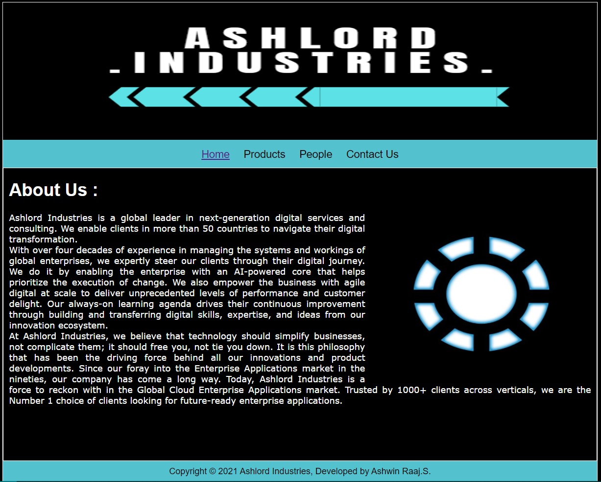
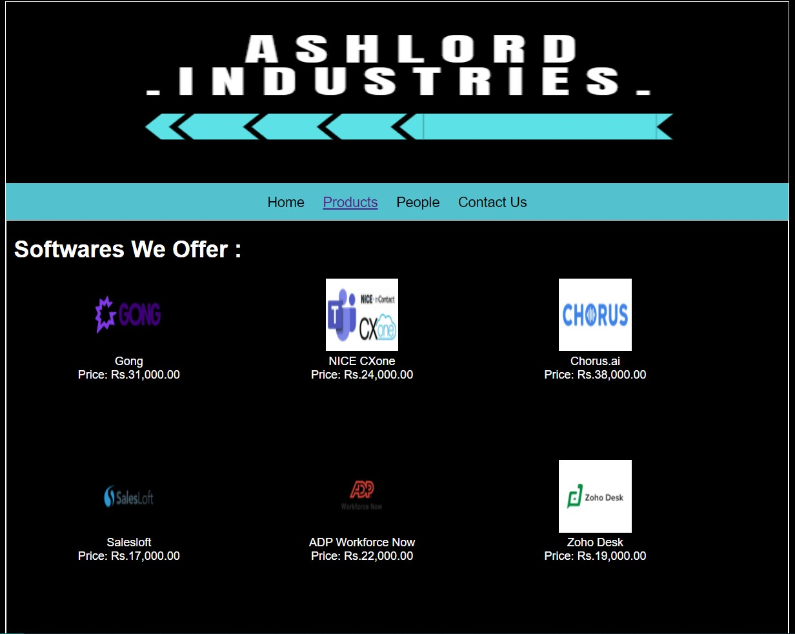
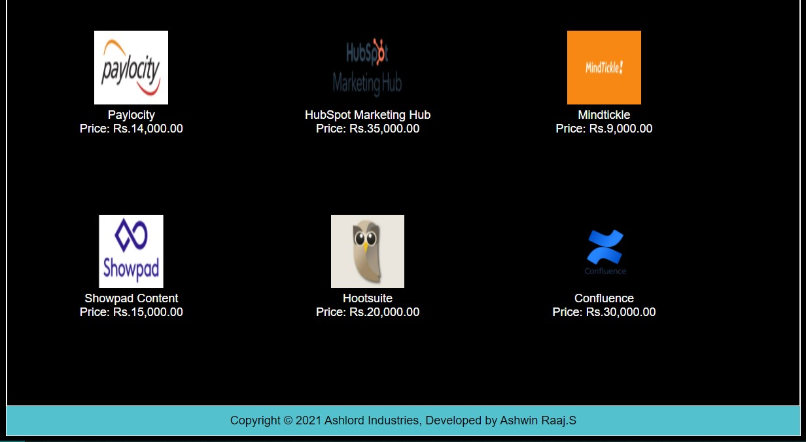
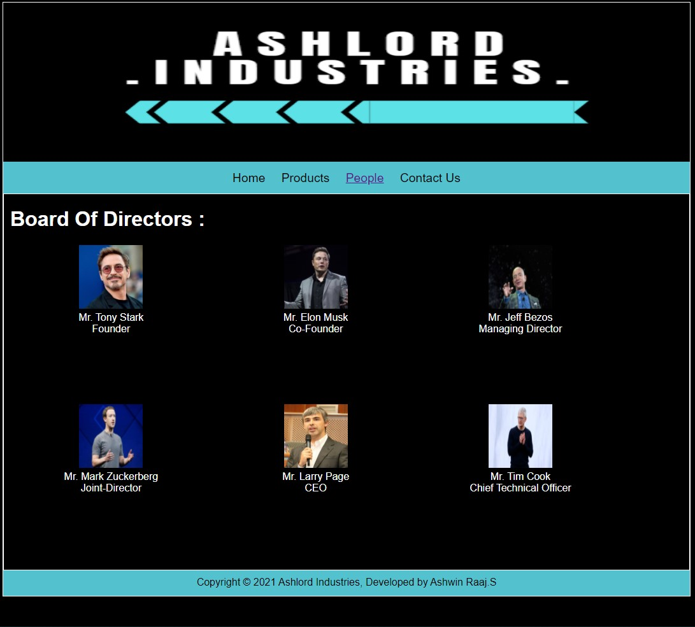
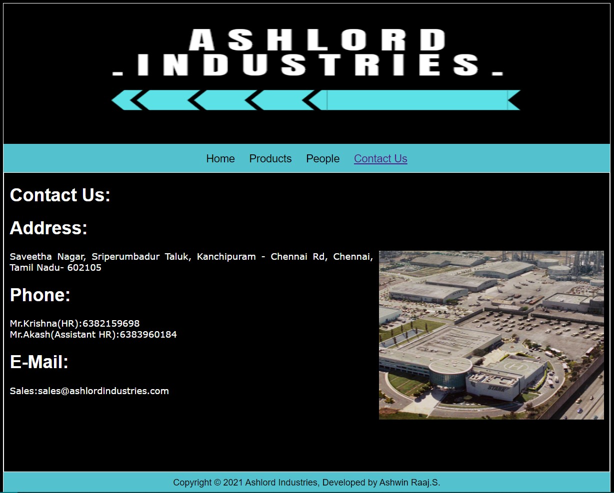

# Web Design for a Software Product Company

## AIM:

To design a static website for a software product company company.

## DESIGN STEPS:

### Step 1:

Requirement collection.

### Step 2:

Creating the layout using HTML and CSS.

### Step 3:

Updating the sample content.

### Step 4:

Choose the appropriate style and color scheme.

### Step 5:

Validate the layout in various browsers.

### Step 6:

Validate the HTML code.

### Step 6:

Publish the website in the given URL.

## PROGRAM :

### Home Page:
```
<!DOCTYPE html>
<html lang="en">
  <head>
    <title>AshLord Industries</title>
    <link rel="stylesheet" href="./css/layout.css" />
    <link rel="icon" href="./img/ail.png" type="image/x-icon" />
  </head>

  <body>
    <div class="container">
      <div class="banner"></div>
      <div class="menu">
        <div class="menuitemselected"><a href="/static/home.html">Home</a></div>
        <div class="menuitem"><a href="/static/products.html">Products</a></div>
        <div class="menuitem"><a href="/static/people.html">People</a></div>
        <div class="menuitem"><a href="/static/contactus.html">Contact Us</a></div>
      </div>
      <div class="content">
        <div class="homecontent">
          <h1>About Us :</h1>
          
          <div class="contenttext">
            Ashlord Industries is a global leader in next-generation digital services and consulting. We enable 
            clients in more than 50 countries to navigate their digital transformation.
            <br/>
            With over four decades of experience in managing the systems and workings of global enterprises, 
            we expertly steer our clients through their digital journey. We do it by enabling the enterprise 
            with an AI-powered core that helps prioritize the execution of change. We also empower the business 
            with agile digital at scale to deliver unprecedented levels of performance and customer delight. Our 
            always-on learning agenda drives their continuous improvement through building and transferring digital skills, 
            expertise, and ideas from our innovation ecosystem.


            <br />
            At Ashlord Industries, we believe that technology should simplify businesses, not complicate them;
             it should free you, not tie you down. It is this philosophy that has been the driving force behind all our
              innovations and product developments. Since our foray into the Enterprise Applications market in the nineties, 
              our company has come a long way. Today, Ashlord Industries is a force to reckon with in the Global Cloud Enterprise 
              Applications market. Trusted by 1000+ clients across verticals, we are the Number 1 choice of clients looking for 
              future-ready enterprise applications.
          </div>
        </div>
      </div>
      <div class="footer">
        Copyright &#169; 2021 Ashlord Industries, Developed by Ashwin Raaj.S.
      </div>
    </div>
  </body>
</html>
 ```

### Products Page:

```
<!DOCTYPE html>
<html lang="en">
  <head>
    <title>AshLord Industries</title>
    <link rel="stylesheet" href="./css/layout.css" />
    <link rel="icon" href="./img/ail.png" type="image/x-icon" />
  </head>

  <body>
    <div class="container">
      <div class="banner"></div>
      <div class="menu">
        <div class="menuitem"><a href="/static/home.html">Home</a></div>
        <div class="menuitemselected">
          <a href="/static/products.html">Products</a>
        </div>
        <div class="menuitem"><a href="/static/people.html">People</a></div>
        <div class="menuitem"><a href="/static/contactus.html">Contact Us</a></div>
      </div>
      <div class="content">
        <div class="productcontent">    
          <h1>Softwares We Offer :</h1>
          <div class="productitems">
              <div class="productitem"> 
                  <div class="itemimage">
                  
                  </div>
                  <div class="itemname">Gong</div>
                  <div class="itemprice">Price: Rs.31,000.00 </div>
              </div>
              <div class="productitem"> 
                  <div class="itemimage">
                  
                  </div>
                  <div class="itemname">NICE CXone</div>
                  <div class="itemprice">Price: Rs.24,000.00 </div>
              </div>
              <div class="productitem"> 
                  <div class="itemimage">
                  
                  </div>
                  <div class="itemname">Chorus.ai</div>
                  <div class="itemprice">Price: Rs.38,000.00 </div>
              </div>
              <div class="productitem"> 
                  <div class="itemimage">
                  
                  </div>
                  <div class="itemname">Salesloft</div>
                  <div class="itemprice">Price: Rs.17,000.00 </div>
              </div>
              <div class="productitem"> 
                  <div class="itemimage">
                  
                  </div>
                  <div class="itemname">ADP Workforce Now</div>
                  <div class="itemprice">Price: Rs.22,000.00 </div>
              </div>
              <div class="productitem"> 
                  <div class="itemimage">
                  
                  </div>
                  <div class="itemname">Zoho Desk</div>
                  <div class="itemprice">Price: Rs.19,000.00 </div>
              </div>
              <div class="productitem"> 
                  <div class="itemimage">
                  
                  </div>
                  <div class="itemname">Paylocity</div>
                  <div class="itemprice">Price: Rs.14,000.00 </div>
              </div>
              <div class="productitem"> 
                  <div class="itemimage">
                  
                  </div>
                  <div class="itemname">HubSpot Marketing Hub</div>
                  <div class="itemprice">Price: Rs.35,000.00 </div>
              </div>
              <div class="productitem"> 
                  <div class="itemimage">
                  
                  </div>
                  <div class="itemname">Mindtickle</div>
                  <div class="itemprice">Price: Rs.9,000.00 </div>
              </div>
              <div class="productitem"> 
                  <div class="itemimage">
                  
                  </div>
                  <div class="itemname">Showpad Content</div>
                  <div class="itemprice">Price: Rs.15,000.00 </div>
              </div>
              <div class="productitem"> 
                  <div class="itemimage">
                  
                  </div>
                  <div class="itemname">Hootsuite</div>
                  <div class="itemprice">Price: Rs.20,000.00 </div>
              </div>
              <div class="productitem"> 
                  <div class="itemimage">
                  
                  </div>
                  <div class="itemname">Confluence</div>
                  <div class="itemprice">Price: Rs.30,000.00 </div>
              </div>
          </div>
          </div>        
      </div>
      <div class="footer">
        Copyright &#169; 2021 Ashlord Industries, Developed by Ashwin Raaj.S
      </div>
    </div>
  </body>
</html>
```

### People Page:

```
<!DOCTYPE html>
<html lang="en">
  <head>
    <title>AshLord Industries</title>
    <link rel="stylesheet" href="./css/layout.css" />
    <link rel="icon" href="./img/ail.png" type="image/x-icon" />
  </head>

  <body>
    <div class="container">
      <div class="banner"></div>
      <div class="menu">
        <div class="menuitem"><a href="/static/home.html">Home</a></div>
        <div class="menuitem"><a href="/static/products.html">Products</a></div>
        <div class="menuitemselected"><a href="/static/people.html">People</a></div>
        <div class="menuitem"><a href="/static/contactus.html">Contact Us</a></div>
      </div>
      <div class="content">
        <div class="productcontent">    
          <h1>Board Of Directors :</h1>
          <div class="productitems">
              <div class="productitem"> 
                  <div class="itemimage">
                  
                  </div>
                  <div class="itemname">Mr. Tony Stark</div>
                  <div class="itemprice">Founder </div>
              </div>
              <div class="productitem"> 
                  <div class="itemimage">
                  
                  </div>
                  <div class="itemname">Mr. Elon Musk</div>
                  <div class="itemprice">Co-Founder </div>
              </div>
              <div class="productitem"> 
                  <div class="itemimage">
                  
                  </div>
                  <div class="itemname">Mr. Jeff Bezos</div>
                  <div class="itemprice">Managing Director </div>
              </div>
              <div class="productitem"> 
                  <div class="itemimage">
                  
                  </div>
                  <div class="itemname">Mr. Mark Zuckerberg</div>
                  <div class="itemprice"> Joint-Director </div>
              </div>
              <div class="productitem"> 
                  <div class="itemimage">
                  
                  </div>
                  <div class="itemname">Mr. Larry Page</div>
                  <div class="itemprice"> CEO </div>
              </div>
               <div class="productitem"> 
                  <div class="itemimage">
                  
                  </div>
                  <div class="itemname">Mr. Tim Cook</div>
                  <div class="itemprice"> Chief Technical Officer </div>
              </div>
          </div>
          </div>        
      </div>
      <div class="footer">
        Copyright &#169; 2021 Ashlord Industries, Developed by Ashwin Raaj.S
      </div>
    </div>
  </body>
</html>
```

### Contact Us Page:

```
<!DOCTYPE html>
<html lang="en">
  <head>
    <title>AshLord Industries</title>
    <link rel="stylesheet" href="./css/layout.css" />
    <link rel="icon" href="./img/ail.png" type="image/x-icon" />
  </head>

  <body>
    <div class="container">
      <div class="banner"></div>
      <div class="menu">
        <div class="menuitem"><a href="/static/home.html">Home</a></div>
        <div class="menuitem"><a href="/static/products.html">Products</a></div>
        <div class="menuitem"><a href="/static/people.html">People</a></div>
        <div class="menuitemselected"><a href="/static/contactus.html">Contact Us</a></div>
      </div>
      <div class="content">
        <div class="homecontent">
          <h1>Contact Us:</h1>
          <h1>Address:</h1>
          
          <div class="contenttext">
            Saveetha Nagar, Sriperumbadur Taluk, Kanchipuram - Chennai Rd, Chennai, Tamil Nadu- 602105
          </div>
          <h1>Phone:</h1>
          <div class="contenttext">
              Mr.Krishna(HR):6382159698<br/>
              Mr.Akash(Assistant HR):6383960184
          </div>
          <h1>E-Mail:</h1>
          <div class="contenttext">
              Sales:sales@ashlordindustries.com
          </div>
        </div>
      </div>
      <div class="footer">
        Copyright &#169; 2021 Ashlord Industries, Developed by Ashwin Raaj.S.
      </div>
    </div>
  </body>
</html>
```

### CSS:

```
* {
  box-sizing: border-box;
  font-family: Arial, Helvetica, sans-serif;
}
body {
  background-color: black;
  color: white;
}
.container {
  width: 1080px;
  margin-left: auto;
  margin-right: auto;
  border-width: 1px 1px 1px 1px;
  border-style: solid;
  box-shadow: 15px 15px 8px black;
}

.banner {
  display: block;
  width: 100%;
  height: 250px;
  text-align: center;
  font-size: 60px;
  background-image: url("/static/img/ail.png");
  background-size: 100% 100%;
  margin: 0px 0px 0px 0px;
  padding-top: 150px ;
}

.menu {
  display: block;
  width: 100%;
  height: 50px;
  font-size: larger;
  background-color: #59ccdbf1;
  text-align: center;
  padding-top: 15px;
  margin: 0px 0px 0px 0px;
  border-width: 1px;
}

.menuitem {
  display: inline-block;
  margin-left: 10px;
  margin-right: 10px;
}
.menuitemselected {
  display: inline-block;
  margin-left: 10px;
  margin-right: 10px;
  color: black;
}

.menuitem a {
  text-decoration: none;
  color: #000000;
}

.content {
  display: block;
  width: 100%;
  background-color: black;
  min-height: 500px;
  margin: 0px 0px 0px 0px;
  border-width: 1px;
  border-color: white;
  border-style: solid;
}
.homecontent {
  min-height: 500px;
  margin: 10px 10px 10px 10px;
}
.homecontent h1 {
  text-align: left;
}
.homecontent img {
  float: right;
  width: 400px;
  height: 300px;
  margin-left: 10px;
}
.homecontent h2{
  text-align: left;
}
.contenttext {
  text-align: justify;
  font-family: Verdana, Geneva, Tahoma, sans-serif;
  color: white;
}

.productcontent {
  min-height: 500px;
  margin: 10px 10px 10px 10px;
}

.productcontent h1 {
  text-align: left;
}

.productitems {
  display: block;
}

.productitem {
  display: inline-block;
  width: 30%;
  height: 250px;
  text-align: center;
}

.productitem img {
  width: 100px;
  height: 100px;
  display: block;
}
.productitem .itemimage {
  display: block;
  margin-left: auto;
  margin-right: auto;
  width: 100px;
  margin-bottom: 5px;
}

.productitem .itemname {
  display: block;
  color: white;
}
.productitem .itemprice {
  display: block;
  color: white;
}

.footer {
  display: block;
  width: 100%;
  height: 40px;
  background-color: #59ccdbf1;
  text-align: center;
  padding-top: 10px;
  margin: 0px 0px 0px 0px;
  color: black;
}
```

## OUTPUT:

### Home Page:



### Products Page:





### People Page:



### Contact Us:



## Result:

Thus a website is designed for the software product company and the HTML,CSS code are validated.
